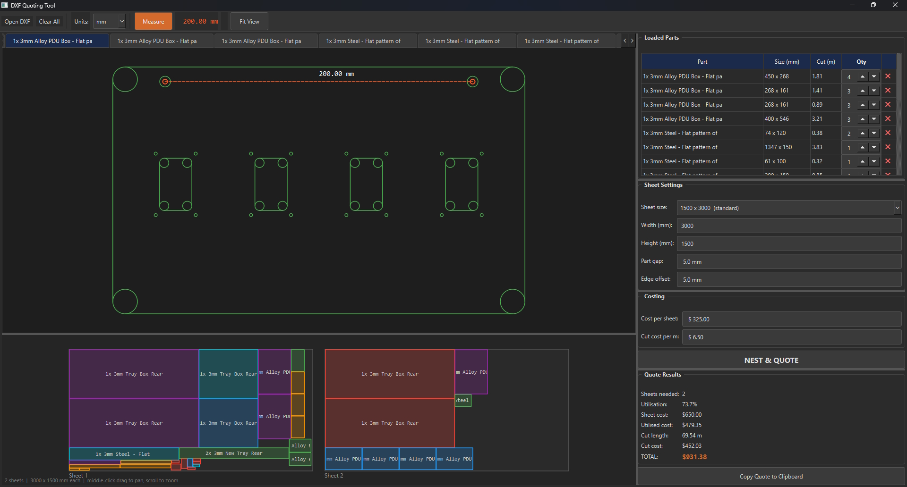

# DXF Quoting Tool

> **Warning - 100% vibe coded DXF viewing + measuring + nesting tool.**
>
> I have forever been frustrated that there is no decent light weight free program for opening a DXF, checking the basic dimensions and nesting them onto sheets. The last one I found forced you to load each DXF individually... WHAT.
>
> This tool is for simply figuring out how many sheets need to be ordered and how much it's all going to cost given a bunch of DXF files.
>
>I generally make boxes and things that are square, threfore to simplify the nesting calculations it just works off the overall dimensions with 0 or 90 degrees of freedom.
>
>It also doesn't account for if there is a void in the part that could be filled with smaller parts - the actual CNC profile cutter will have a nester that can do this so consider it conservative.
>The program does not generate or export a tool path.
>
>One issue is that the rendering of some of the arcs display as full circles but don't effect the cut length. Since in toolpaths are actually created from this program it doesn't matter.
>
>Feel free to fork and add whatever you want.



A desktop Python GUI for loading DXF flat-pattern files, viewing geometry, measuring between points, nesting parts onto standard sheet sizes, and generating cost quotes for sheet metal cutting jobs.


## What It Does

- **Load DXF files** -- parses LINE, ARC, CIRCLE, LWPOLYLINE, and ELLIPSE entities from DXF modelspace using `ezdxf`.
- **View geometry** -- renders each loaded part in its own tabbed canvas with pan (middle-mouse drag), zoom (scroll wheel centred on cursor), and dark background.
- **Measure** -- toggle measure mode, click two snap points (endpoints, centres, cardinal points of circles) to get the distance in mm.
- **Nest parts** -- rectangular bounding-box nesting onto user-defined sheet sizes using a bottom-left-fill algorithm. Supports 0 and 90 degree rotation, configurable part gap and edge offset, and part quantities.
- **Quote** -- calculates sheet cost, cut cost (per metre of cutting), utilised cost (based on material utilisation percentage), and a total.
- **Multi-sheet** -- if parts don't fit on one sheet, additional sheets are added and displayed side-by-side in the nest preview.


## Project Structure

```
dxf_quoting_tool/
  main.py                 # Entry point -- creates QApplication and MainWindow
  requirements.txt        # Python dependencies
  core/
    dxf_loader.py         # DXF parsing, geometry extraction, bounding box, cut length
    nesting.py            # Bottom-left-fill nesting algorithm, quote calculation
  gui/
    main_window.py        # Main window layout, controls, parts table, results
    dxf_canvas.py         # Per-part DXF geometry renderer with pan/zoom/measure
    nest_canvas.py        # Nested sheet layout preview (all sheets side-by-side)
```


## Toolchain

| Component     | Library / Tool     | Version   | Purpose                                    |
|---------------|--------------------|-----------|--------------------------------------------|
| DXF parsing   | `ezdxf`            | >= 1.3.0  | Read DXF files, extract entities           |
| GUI framework | `PyQt6`            | >= 6.6.0  | Desktop window, widgets, QPainter canvas   |
| Geometry      | `shapely`          | >= 2.0.0  | Available for future geometry ops          |
| Packaging     | `pyinstaller`      | >= 6.0.0  | Bundle as standalone .exe (not yet done)   |
| Python        |                    | 3.13+     | Tested on 3.13                             |


## How to Run

```bash
# Install dependencies
pip install -r requirements.txt

# Run the tool
python main.py
```


## How the Core Modules Work

### DXF Loader (`core/dxf_loader.py`)

- Reads a DXF file with `ezdxf.readfile()`.
- Iterates over modelspace entities and converts each to one or more `GeomSegment` objects (kind: line, arc, or circle).
- **Important**: Arc is checked before Circle in the isinstance chain because ezdxf's Arc class inherits from Circle. Checking Circle first would misparse arcs as full circles.
- LWPolyline entities are decomposed into line and arc segments, handling bulge values for curved segments.
- Ellipses are approximated as circles using the Ramanujan perimeter formula.
- Computes a bounding box from all geometry points and a total cut length from segment lengths.
- Returns a `DxfPart` dataclass with name, filepath, segments, units, bbox, and total_cut_length.
- Units are read from the DXF header `$INSUNITS` code, with an optional override.

### Nesting (`core/nesting.py`)

- **Algorithm**: Bottom-left-fill. For each part (sorted by area, largest first), it tries every existing sheet before opening a new one.
- For each candidate position, it scans X candidates (left edge margin + right edge of every placed part + gap), then for each X scans Y candidates (top edge margin + top edge of overlapping placed parts + gap).
- Both 0 and 90 degree orientations are tried; the leftmost (then lowest) valid position wins.
- `edge_offset` controls minimum distance from sheet edges (separate from part-to-part `gap`).
- `calculate_quote()` takes a `NestResult`, sheet cost, and cut cost per metre to produce a `QuoteResult`.

### DXF Canvas (`gui/dxf_canvas.py`)

- Custom QWidget that renders geometry with QPainter.
- Coordinate transform: DXF Y-up to screen Y-down via `_to_screen()` / `_to_dxf()`.
- Arcs are rendered as full circles to avoid visual artefacts from the Y-flip. Cut length calculation still uses the correct arc length.
- Snap points are collected from all endpoints, centres, and cardinal points of circles for the measurement tool.
- Each canvas has a `part_colour` property set by the main window to keep colours consistent with the nest preview.

### Nest Canvas (`gui/nest_canvas.py`)

- Renders all sheets side-by-side in data-space with a proportional gap between them.
- Parts are drawn as coloured rectangles with labels (suppressed if too small to read).
- Colour map is passed in from the main window to match the part viewer tabs.
- Pan/zoom with middle-mouse and scroll wheel.

### Main Window (`gui/main_window.py`)

- Layout: horizontal QSplitter with left side (canvases) and right side (controls).
- Left: vertical QSplitter with a QTabWidget (closable part viewer tabs) and the NestCanvas.
- Right: vertical QSplitter with four sections -- parts table, sheet settings, costing inputs + nest button, and results.
- Parts table columns: Part name, Size (W x H mm), Cut length (m), Qty (spin box), and a remove button.
- Sheet presets dropdown with standard/common/large sheet sizes. Width and height are also editable directly.
- Custom `NoScrollSpinBox`, `NoScrollComboBox`, `NoScrollIntSpinBox` subclasses prevent accidental value changes from the mouse wheel.
- Clicking a part row switches to that part's viewer tab.
- Colour sync: `_refresh_parts_table()` updates every canvas's `part_colour` from its current index so colours always match the nest preview.


## Quoting Logic

1. Parts are loaded, each with a total cut length (sum of all segment lengths).
2. User sets quantity per part, sheet size, part gap, edge offset.
3. Nesting places qty copies of each part onto sheets.
4. **Sheet cost total** = sheets_used x cost_per_sheet
5. **Utilised cost** = sheet_cost_total x (utilisation% / 100) -- represents the material actually consumed by the job (the engineer keeps the offcut).
6. **Cut cost total** = total_cut_length_in_metres x cost_per_metre
7. **Grand total** = utilised_cost + cut_cost_total


## Known Limitations and Design Decisions

- **Arc rendering**: Arcs are drawn as full circles on screen. This is a deliberate trade-off -- correctly rendering arcs with QPainter while flipping the Y axis produced visual artefacts on certain quadrants. The cut length calculation is still accurate.
- **Bounding-box nesting only**: Parts are nested by their rectangular bounding box, not by true part outline. This is conservative (wastes some sheet area) but simple and fast.
- **No DXF output**: The tool is for quoting, not for generating toolpaths or saving nested DXF files.
- **No construction line filtering**: All entities in modelspace are treated as cut geometry. If the DXF contains construction lines on specific layers, they will be included in the cut length. Layer visibility can be toggled but doesn't affect cut calculations.


## Packaging as .exe

Bundle with PyInstaller:

```bash
pip install -r requirements.txt
pyinstaller --onefile --windowed --name "DXF Quoting Tool" main.py
```

The resulting .exe will be in `dist/`. PyInstaller is already in requirements.txt. First launch takes a few seconds as `--onefile` extracts to a temp folder.
